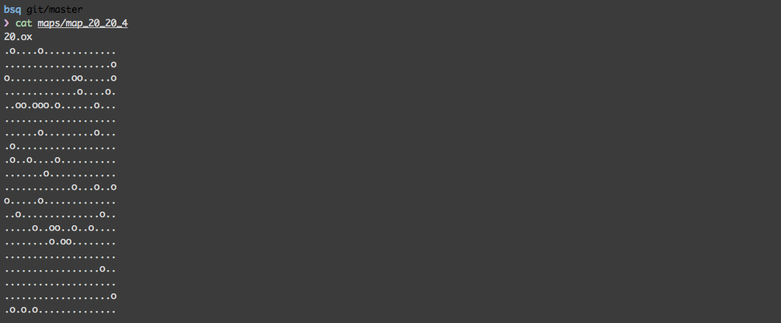
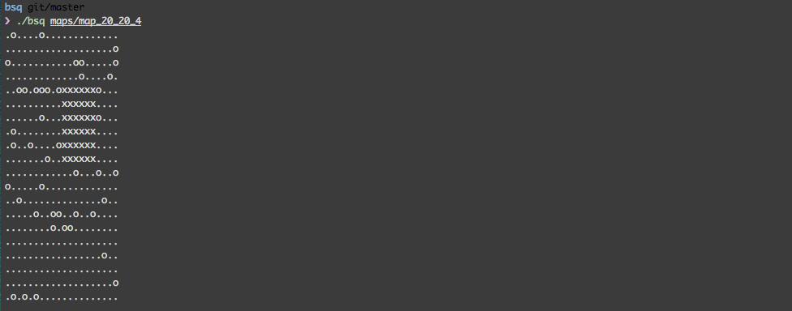

# Projet Piscine C - BSQ

Il s’agit de trouver le plus grand carré vide possible sur une carte remplie d'obstacle.
Un plateau est passé en argument du programme.



##compiler le programme
dans le dossier du projet :
```
make
```

##executer le programme
```
./bsq maps/map_20_20_4
```


